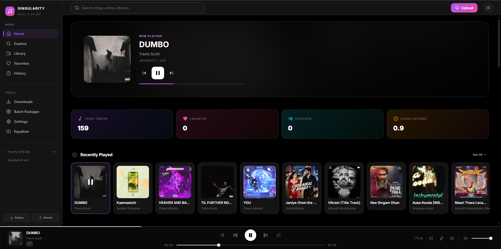
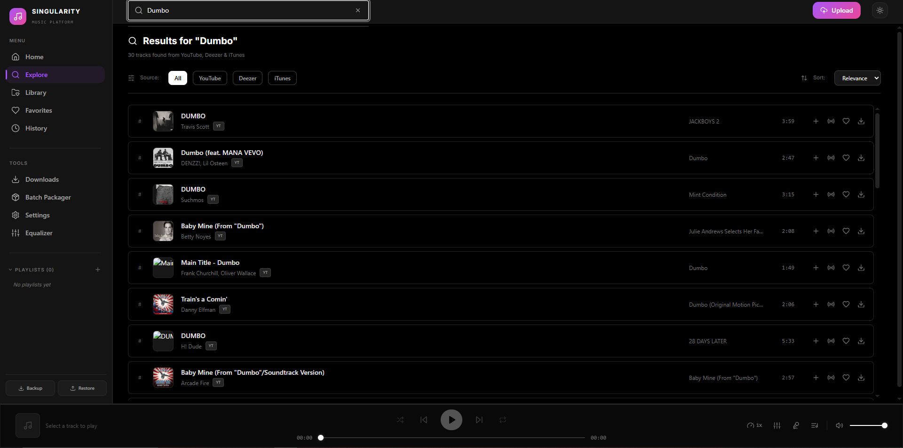
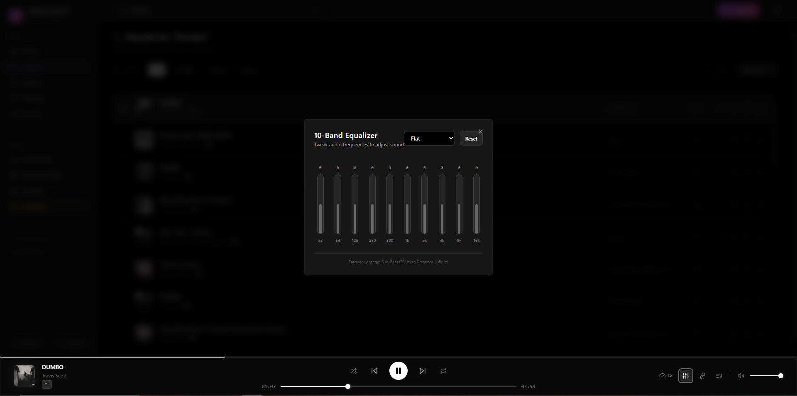
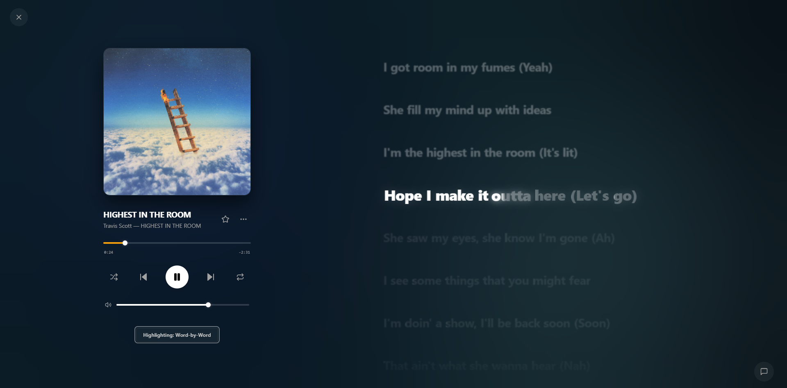

<p align="center">
  
  
  
  
</p>

<h1 align="center">🎵 Singularity Player</h1>

<p align="center">
  <strong>A premium, self-hosted music player with on-demand YouTube streaming, a studio-grade audio engine, and a beautiful modern interface.</strong>
</p>

<p align="center">
  Search for any song. Stream it instantly. Shape the sound. Keep it forever.<br/>
  All running on your own machine. No accounts. No tracking. No limits.
</p>

---

## 🖥️ Screenshots

<p align="center">
  
  
</p>
<br/>
<p align="center">
  
  
</p>

---

## 🧭 Table of Contents

- [How It Works](#-how-it-works)
- [Features](#-features)
- [Tech Stack](#-tech-stack)
- [Getting Started](#-getting-started)
  - [Native Mobile App (Capacitor)](#-native-mobile-app-capacitor)
  - [Hosting Backend on Render](#-hosting-backend-on-render)
- [Configuration](#-configuration)
- [Project Structure](#-project-structure)
- [Keyboard Shortcuts](#-keyboard-shortcuts)
- [Troubleshooting](#-troubleshooting)
- [Contributing](#-contributing)
- [Disclaimer](#%EF%B8%8F-disclaimer)
- [License](#-license)

---

## 🔍 How It Works

Singularity Player is a two-part system — a **React frontend** that runs in your browser and a **Node.js backend** that runs on your machine — working together to give you a full music platform experience without relying on any third-party service for playback or storage.

### The Search & Streaming Pipeline

When you type a song name into the search bar, the backend queries multiple music metadata APIs (Deezer, iTunes) to find matching tracks with cover art, album info, and preview URLs. If you choose to play a track that comes from YouTube, the backend uses [`yt-dlp`](https://github.com/yt-dlp/yt-dlp) — a powerful open-source media extractor — to resolve a direct audio stream URL in real time. That URL is then proxied through the backend as a standard HTTP audio stream with full support for range requests, meaning the browser can seek to any position in the song instantly without re-downloading the entire file.

### Prefetching & Zero-Wait Playback

The moment you hover over a track card or when the current song is halfway through, the system silently resolves the **next** track's stream URL in the background. By the time you hit "Next" or the song naturally ends, the audio is already prepared — transitions happen in under a second. The backend also coalesces duplicate requests: if 5 UI events all ask for the same track at once, only one extraction actually runs, and all 5 share the result.

### The Audio Engine

The player doesn't just play audio — it processes it. Under the hood, every audio stream is routed through a **Web Audio API graph** that includes:

- A **10-band parametric equalizer** (32 Hz → 16 kHz) with presets like Bass Boost, Rock, Pop, Vocal, Electronic, Jazz, Classical, and Nightcore — or full manual control
- A **spatial audio processor** that can widen the stereo field, simulate rooms of different sizes, and adjust elevation
- A **crossfade engine** that smoothly blends the tail of one song into the beginning of the next, with configurable overlap duration
- A **volume ramping system** that uses linear gain interpolation to eliminate pops and clicks during play, pause, and volume changes
- A real-time **audio visualizer** rendered on HTML5 Canvas, showing live frequency bars and waveform data

All of this runs entirely in the browser. Nothing is sent back to any server.

### Your Personal Library

Every track you play, favorite, or upload is stored in an **IndexedDB database** inside your browser. This means your library, playlists, play history, favorites, and listening statistics all live locally on your machine — they survive browser restarts, and they never leave your device. You can also upload your own `.mp3`, `.m4a`, or `.wav` files directly, and they'll be stored on your backend server's filesystem alongside the YouTube-streamed tracks.

### Offline & Batch Downloads

Any track can be downloaded and cached as a local audio blob in the browser. The **Batch Packager** lets you queue up dozens of tracks, download them all with staggered pacing, and play them offline without any network connection. Your settings, volume, equalizer bands, and theme are all persisted across sessions via `localStorage`.

### 📝 Advanced Lyrics Engine

Singularity Player features a premium, multi-layered lyrics pipeline that fetches, parses, and caches synchronized lyrics automatically, offering a fully interactive, cinema-grade presentation:

- **Interactive Lyrics-Seeking**: Click or tap on any lyric line to instantly jump the audio playback to that specific point in the track.
- **Apple Music-Style Progressive Sweeps**: Soft, feathered letter-by-letter karaoke coloring and elastic scaling transitions. We've eliminated layout shifts by removing word font-weight overrides, ensuring characters sweep and scale without shifting horizontally.
- **Vocal-Energy Responsive Holds**: Performs real-time vocal presence analysis using a weighted formant range (800–3000 Hz) against fundamentals (200–800 Hz). This drives a dynamic `effectiveEnd` duration extension and energy-shaped progress curves that plateau during sustained vocal notes.
- **GPU-Accelerated Scrolling & Scaling**: Lyric lines transition between `scale(1.12)` (active) and `scale(0.92)` (inactive) with a soft glass blur (`blur(1.2px)` inactive). The layout box heights remain constant, allowing the GPU compositor to render smooth scrolls at up to 120fps with no reflow overhead.
- **Independent Beat-Synced Ambient Backdrop**: Nested floating wrappers isolate the slow CSS orbital float animations from real-time JS-driven scale pulses. Colorful backdrop blobs react independently to the sub-bass of the track for an organic, multi-layered breathing backdrop.
- **Buffer-Aware Playback Sync**: Automatically freezes visual timeline progression when the track is loading or buffering, preventing desynchronization.
- **Multi-Source Aggregation**: Fetches lyrics dynamically from Musixmatch (with Richsync support), LRCLIB, YouTube transcripts, and NetEase, caching results on disk to minimize external api calls.

---

## ✨ Features

### 🎧 Audio Engine
- **10-Band Parametric Equalizer** — 10 presets (Flat, Bass Boost, Treble Boost, Rock, Pop, Vocal, Electronic, Jazz, Classical, Nightcore) plus fully manual per-band control
- **Spatial Audio** — Adjustable stereo width (0–200%), room simulation (Small / Medium / Large), and elevation control
- **Gapless Crossfading** — Configurable 0–10 second overlap between tracks with race-condition-safe dual-player architecture
- **Volume Ramping** — Linear gain interpolation for click-free play/pause transitions
- **Playback Speed Control** — Adjustable from 0.5× to 2.0×
- **Real-Time Visualizer** — Canvas-based frequency bars and waveform rendering, only active when visible

### 🔍 Search & Discovery
- **Multi-Source Search** — Queries Deezer, iTunes, and YouTube simultaneously
- **Trending Suggestions** — Shows popular queries in the search dropdown
- **Search History** — Remember your recent searches with quick recall
- **Artists Library** — circular card grid of listened-to artists with dynamic Apple Music-style profiles
- **Wikipedia Profile Sync** — Automatically fetches biography summaries and high-res artist photos via Wikipedia REST API on the fly
- **Artist & Album Pages** — Browse tracks grouped by artist or album
- **Genre Exploration** — Quick-search genre tiles (Pop, Rock, Electronic, Hip-Hop, Classical, Jazz, R&B, Indie)

### 🎵 Playback & Queue
- **Instant Streaming** — Play any song on demand with full seek support via HTTP range requests
- **Smart Prefetching** — Silently resolves the next track before you need it
- **Queue Management** — Drag-and-drop reordering with visual feedback and album art integration
- **Smart Shuffle** — Balanced interleaving algorithm that prevents consecutive tracks by the same artist/genre and injects library recommendations
- **Autoplay Recommendations** — Automatically appends related songs to the queue with strict artist diversity constraints (no duplicates or artist clustering)
- **Keyboard Shortcuts** — Full keyboard control (see table below)

### 📝 Lyrics & Visualizer
- **Native Word-Level Syncing** — Support for Enhanced LRC formats with character-by-character coloring/sweeps matching the song pace
- **Virtual DOM Glow Fixes** — Reset styling states on active line transitions to prevent visual glow glitches during DOM recycling
- **Vocal-Energy Adaptive Holds** — Formant frequency analysis dynamically extends active word highlighting on sustained vowels and stalls progress at 70–80% until vocals decay
- **Real-Time Visual Glow** — Highlighted words glow dynamically based on real-time vocal presence metrics without introducing highlight lag
- **Custom Sync Offset** — Slider controls (`-400ms` to `+400ms` in `10ms` increments) to adjust visual anticipation for audio latency (persists in `localStorage`)
- **Smart Word Sync Toggle** — Switch between tempo-estimated word sync and clean **Line-by-Line Highlight** (Apple Music style) on standard LRC files
- **Kinetic Lyric Centering** — Smooth GSAP-driven scrolling that centers active lyrics in both sidebar and fullscreen overlays
- **Ambient Blurred Backdrop** — Rotating and floating circular blobs that morph and change color to match the dominant and accent shades of the active album cover art
- **Large Scale Typography** — Shifted layout and adjustable font sizes up to `52px` base scale for enhanced visibility

### 🧠 Smart Queue & Recommendations
- **Smart Queue Service** — Queries YouTube Music dynamically at queue exhaustion to inject recommended related radio tracks
- **Dynamic Playlist Generator** — Automatically builds customized playlists by matching tempo, mood, and listening metadata
- **Playback Analytics Dashboard** — Full visual report of total play counts, top artists, genres, skip ratios, and peak hour trends

### 💾 Library & Offline
- **Local Library** — All tracks stored in IndexedDB, fully offline-capable
- **Playlists** — Create, edit, reorder, and delete custom playlists
- **Smart Playlists** — Rule-based auto-updating playlists by genre, artist, year, play count, or source
- **Favorites** — One-click favoriting with a dedicated favorites view
- **Play History** — Full chronological record of everything you've listened to
- **File Uploads** — Drag-and-drop upload of `.mp3`, `.m4a`, and `.wav` files
- **Batch Packager** — Queue and download multiple tracks for offline playback

### ⚙️ Settings & Customization
- **Dark & Light Theme** — Full theme toggle with system preference detection
- **Accent Colors** — Choose from Purple, Pink, Cyan, Amber, Emerald, or Blue
- **Compact Mode** — Denser layout for smaller screens
- **Persistent Settings** — All preferences saved to localStorage and restored on next visit
- **Configurable Downloads** — Set concurrent download limits and auto-download favorites

### 🎨 Premium Visual Overhaul & Aesthetics
- **Dynamic Hero Section** — Floating organic blobs powered by GSAP, text typing effects, context-aware greetings ("Ready for some [Genre]?"), and blurry parallax background overlays of the featured track cover art.
- **Translucent Glassmorphic Sidebar** — Semi-transparent navigation panel (`backdrop-filter: blur(20px)`) that dynamically blends with the page backdrops, coupled with scaling navigation icons that light up and glow in active states.
- **Now Playing Playbar Elevation** — The album artwork raises slightly and glows when a track starts playing, accompanied by a CSS keyframe-bouncing 3-bar progress bar equalizer.
- **Asymmetric Grid Layout** — Prominent 2x2 featured grids for "Liked Songs" breaking standard grid patterns on desktop.
- **Card Hover Dimming & Previews** — Hovering over any track card dims surrounding cards and, after a 600ms buffer delay, initiates low-volume (0.15) audio preview playback.
- **Mood-Based Background Shifts** — Deep background transitions (like deep blue tint for Chill vibe, deep red for Workout vibe) when a vibe mix is played.

### 📱 Responsive Design
- **Desktop Layout** — Sidebar navigation, spacious content area, slide-out panels
- **Mobile Layout** — Bottom tab navigation, collapsible sidebar, touch-friendly controls
- **Smooth Transitions** — Framer Motion page transitions and micro-animations throughout

---

## 🛠️ Tech Stack

| Layer | Technology |
| :--- | :--- |
| **Frontend Framework** | React 19 + TypeScript |
| **Build Tool** | Vite 8 |
| **UI Components** | Material UI (MUI) 9 |
| **Animations** | Framer Motion |
| **State Management** | Zustand (with localStorage persistence) |
| **Local Database** | IndexedDB via `idb` |
| **Styling** | Tailwind CSS 4 + Custom CSS |
| **Audio Processing** | Web Audio API (AnalyserNode, BiquadFilterNode, ConvolverNode, StereoPannerNode) |
| **Backend Runtime** | Node.js + Express |
| **Media Extraction** | yt-dlp (cross-platform, auto-detected) |
| **Security** | Helmet, CORS, Express Rate Limit |
| **Drag & Drop** | @dnd-kit |
| **Virtualized Lists** | react-virtuoso |
| **Data Fetching** | SWR |

---

## 🚀 Getting Started

### Prerequisites

| Requirement | Details |
| :--- | :--- |
| **Node.js** | v18.0.0 or higher ([download](https://nodejs.org/)) |
| **yt-dlp** | Required for YouTube streaming and downloads (see below) |
| **FFmpeg** | *Optional* — needed for advanced format conversions |

#### Installing yt-dlp

<details>
<summary><strong>Windows</strong></summary>

**Option A (Recommended):** Download `yt-dlp.exe` from [github.com/yt-dlp/yt-dlp/releases](https://github.com/yt-dlp/yt-dlp/releases) and drop it into the `server/` folder.

**Option B:** Install globally via a package manager:
```powershell
winget install yt-dlp
# or
choco install yt-dlp
```
</details>

<details>
<summary><strong>macOS</strong></summary>

```bash
brew install yt-dlp
```
</details>

<details>
<summary><strong>Linux</strong></summary>

```bash
# Debian / Ubuntu
sudo apt install yt-dlp

# Arch Linux
sudo pacman -S yt-dlp

# Or via pip
pip install yt-dlp
```
</details>

> The server automatically checks for a local `yt-dlp.exe` in the `server/` directory first, then falls back to the system `PATH`. This means it works on every platform without any configuration.

---

### Installation

```bash
# 1. Clone the repository
git clone https://github.com/yourusername/singularity-player.git
cd singularity-player

# 2. Install all dependencies (monorepo — installs both client & server)
npm install

# 3. Copy the environment template
cp .env.example .env

# 4. Start the dev server (runs both client & server concurrently)
npm run dev
```

Open [http://localhost:5173](http://localhost:5173) in your browser. The backend API runs at [http://localhost:3001](http://localhost:3001).

### 📱 Hosting for Mobile & Local Network Access

To access Singularity Player from your mobile phone, tablet, or other devices on your home Wi-Fi network:

1. **Find your PC's Local IP Address**:
   * **Windows**: Run `ipconfig` in Command Prompt (look for `IPv4 Address`, e.g., `192.168.1.15`).
   * **macOS/Linux**: Run `ifconfig` or `ip a` in the terminal.
2. **Update your `.env` configuration**:
   Change `.env` to make the server accessible across the network and allow requests from your mobile browser:
   ```env
   PORT=3001
   ALLOWED_ORIGINS=http://localhost:5173,http://127.0.0.1:5173,http://<YOUR-PC-IP>:5173
   VITE_API_URL=http://<YOUR-PC-IP>:3001
   ```
3. **Start the application**:
   Run the dev server with the `--host` flag to expose it to your local network:
   ```bash
   npm run dev -- --host
   ```
4. **Access from Mobile**:
   Open your mobile browser (Safari, Chrome) and navigate to `http://<YOUR-PC-IP>:5173`.

> [!TIP]
> For a native app experience on iOS and Android, open the page in your mobile browser and use **"Add to Home Screen"** to launch it as a full-screen, standalone web app.

### 📲 Native Mobile App (Capacitor)

For a fully native, premium app experience on iOS and Android with features like hardware back button mapping, system status bar styling, and native performance, you can build a native shell using **Capacitor**.

#### 🛠️ Prerequisites
1. **Android SDK & Android Studio** (for Android builds) or **Xcode** (for iOS builds).
2. Switch to the Capacitor feature branch:
   ```bash
   git checkout feature/capacitor-app
   ```

#### 🏗️ Building and Launching
1. **Install mobile dependencies** (run in the root folder):
   ```bash
   npm install
   ```
2. **Compile the client code** pointing to your backend:
   ```powershell
   # For local network backend, use your PC's IP address:
   $env:VITE_API_URL="http://<YOUR-PC-IP>:3001"
   
   # For cloud backend, use your Render URL:
   $env:VITE_API_URL="https://your-app-name.onrender.com"
   
   npm run build:client
   ```
   *(For macOS/Linux, use: `VITE_API_URL="https://your-app-name.onrender.com" npm run build:client`)*
3. **Sync files with Capacitor**:
   ```bash
   cd client
   npx cap sync
   ```
4. **Open the project in Android Studio / Xcode**:
   ```bash
   npx cap open android
   # or
   npx cap open ios
   ```
5. **Generate the APK**:
   * In Android Studio: Go to **Build** -> **Generate App Bundles or APKs** -> **Build APK(s)**.
   * Transfer the generated `app-debug.apk` to your phone and install it!

---

### ☁️ Hosting Backend on Render (Cloud)

To use your music player on the go without keeping your PC powered on at home, you can host the backend server on the **Render Free Tier**.

#### ⚙️ Environment Variables Config (Render Dashboard)
Add these keys in your Render **Environment** settings:

| Variable | Value | Description |
| :--- | :--- | :--- |
| `NODE_ENV` | `production` | Enables production optimizations. |
| `MAX_CONCURRENT_PROCESSES` | `2` | **(Critical)** Restricts `yt-dlp` concurrency to 2 to prevent Render OOM (Out Of Memory) crashes. |
| `ENABLE_DISK_CACHE` | `false` | **(Critical)** Disables background download-to-disk pipelines on Render's ephemeral disk, drastically reducing CPU/RAM spikes. |
| `PUBLIC_URL` | `https://your-app-name.onrender.com` | Enables the built-in self-pinging loop to prevent Render from going to sleep. |
| `ALLOWED_ORIGINS` | `*` | Allows your mobile app's native WebView origin (`http://localhost`) to fetch API requests. |

#### 🏗️ Build & Start Settings
* **Build Command**: `npm install --include=dev && npm run build:server`
* **Start Command**: `npm start`
* **Health Check Path**: `/api/health`

#### ⏰ Keep-Alive (Prevent Sleep Mode)
To guarantee your server stays awake 24/7, set up a free monitor on [UptimeRobot](https://uptimerobot.com/) or [Cron-Job.org](https://cron-job.org/) pointing to `https://your-app-name.onrender.com/api/health` with a **10-minute interval**.

---

### Production Build

```bash
# Build both client and server
npm run build

# Start the production server
npm run start
```

---
---

## ⚙️ Configuration

Copy `.env.example` to `.env` and customize as needed:

| Variable | Description | Default |
| :--- | :--- | :--- |
| `PORT` | Backend server port | `3001` |
| `ALLOWED_ORIGINS` | CORS-allowed origins (comma-separated) | `http://localhost:5173,http://127.0.0.1:5173` |
| `NODE_ENV` | Environment (`development` / `production`) | `development` |
| `VITE_API_URL` | Backend URL for the frontend to connect to | `http://localhost:3001` |

---

## 📁 Project Structure

```
singularity-player/
│
├── client/                          # React Frontend (Vite)
│   ├── src/
│   │   ├── components/
│   │   │   ├── analytics/           # Listening insights dashboard
│   │   │   ├── discovery/           # Artist & album pages
│   │   │   ├── downloads/           # Download manager, batch packager
│   │   │   ├── home/                # Home page with hero, stats, recommendations
│   │   │   ├── layout/              # Sidebar, TopBar, PlayerBar, MobileNav
│   │   │   ├── library/             # Library, favorites, history, playlists
│   │   │   ├── player/              # Equalizer, visualizer, lyrics, queue
│   │   │   ├── search/              # Search input, results, track cards
│   │   │   ├── settings/            # Settings page
│   │   │   ├── ui/                  # Shared UI (toast, dialogs, context menu)
│   │   │   └── upload/              # File upload zone
│   │   ├── hooks/                   # useAudioEngine, useLibraryDB, useKeyboardShortcuts
│   │   ├── stores/                  # Zustand stores (player, settings, downloads, batch)
│   │   ├── services/                # Recommendation engine
│   │   ├── utils/                   # API client, formatDuration, source labels
│   │   ├── theme/                   # MUI theme tokens
│   │   ├── types/                   # TypeScript interfaces
│   │   └── main.tsx                 # App entry point
│   └── package.json
│
├── server/                          # Express Backend
│   ├── src/
│   │   ├── routes/
│   │   │   ├── search.ts            # Multi-source music search
│   │   │   ├── yt.ts                # YouTube info, streaming proxy, prefetch
│   │   │   ├── stream.ts            # Local file streaming
│   │   │   ├── download.ts          # Track download endpoint
│   │   │   ├── downloads.ts         # Download management (list, delete)
│   │   │   ├── lyrics.ts            # Lyrics fetching
│   │   │   └── upload.ts            # File upload handling
│   │   ├── services/
│   │   │   ├── youtubeService.ts     # yt-dlp integration, caching, coalescing
│   │   │   ├── searchService.ts      # Deezer/iTunes API aggregation
│   │   │   ├── lyricsService.ts      # Lyrics API integration
│   │   │   ├── downloadManager.ts    # Download queue and file management
│   │   │   ├── metadataService.ts    # Audio file metadata extraction
│   │   │   └── processPool.ts        # yt-dlp process pool management
│   │   └── index.ts                  # Express server entry point
│   └── package.json
│
├── .env.example                     # Environment variable template
├── .gitignore                       # Git ignore rules
├── LICENSE                          # MIT License
├── package.json                     # Monorepo workspace configuration
└── README.md                        # You are here
```

---

## ⌨️ Keyboard Shortcuts

| Key | Action |
| :--- | :--- |
| `Space` | Play / Pause |
| `←` | Seek backward 5 seconds |
| `→` | Seek forward 5 seconds |
| `↑` | Volume up |
| `↓` | Volume down |
| `N` | Next track |
| `P` | Previous track |
| `M` | Toggle mute |
| `S` | Toggle shuffle |
| `R` | Cycle repeat mode (Off → One → All) |

> Shortcuts are automatically disabled when you're typing in a search box or text field.

---

## 🛠️ Troubleshooting

<details>
<summary><strong>Audio plays but there's no sound / silence</strong></summary>

This happens when the browser's security policy blocks the Web Audio API from processing cross-origin audio streams. The app handles this automatically by setting `crossOrigin = 'anonymous'` on audio elements and routing streams directly through the backend API. Make sure your `ALLOWED_ORIGINS` env variable includes the exact URL of your frontend (e.g., `http://localhost:5173`).
</details>

<details>
<summary><strong>yt-dlp not found / streams won't start</strong></summary>

The server looks for `yt-dlp` in two places, in order:
1. A local `yt-dlp.exe` file in the `server/` directory
2. The system `PATH`

Run `yt-dlp --version` in your terminal to verify it's installed. If you're on Windows, you can also just drop the `.exe` into the `server/` folder.
</details>

<details>
<summary><strong>Slow first play (~3-5 seconds)</strong></summary>

The first time you play a YouTube track, `yt-dlp` needs to resolve the stream URL, which takes a few seconds. Subsequent plays of the same track use a server-side cache and resolve in under 250ms. The app also prefetches the next track in the queue automatically to minimize wait times.
</details>

<details>
<summary><strong>Port already in use</strong></summary>

Change the `PORT` variable in your `.env` file. The frontend's `VITE_API_URL` must match whatever port the backend runs on.
</details>

---

## 🤝 Contributing

Contributions are welcome! Feel free to open issues or submit pull requests.

1. Fork the repository
2. Create your feature branch (`git checkout -b feature/amazing-feature`)
3. Commit your changes (`git commit -m 'Add amazing feature'`)
4. Push to the branch (`git push origin feature/amazing-feature`)
5. Open a Pull Request

---

## ⚖️ Disclaimer

> **This software is intended for personal use and self-hosting only.**
>
> - This repository does **not** host, distribute, or bundle any copyrighted music, audio files, or media content.
> - By using this software to stream or download content from YouTube or other platforms, **you** assume full responsibility for compliance with the respective platform's Terms of Service and all applicable copyright laws in your jurisdiction.
> - The developers of this project are not responsible for any misuse.

---

## 📄 License

This project is licensed under the [MIT License](LICENSE).

---

<p align="center">
  Built with ♪ by <a href="https://github.com/yourusername">takedaa</a>
</p>
